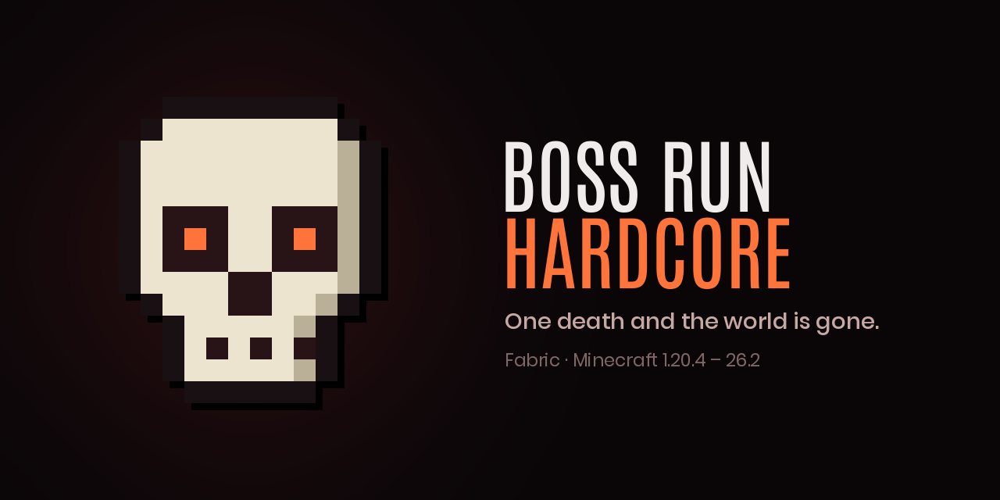

<div align="center">

<sub><b>Polski</b> · <a href="README.en.md">English</a></sub>

<sub><a href="CHANGELOG.md">Historia zmian</a></sub>

# ☠ Boss Run Hardcore

**Wyzwanie hardcore na cały skład: ktokolwiek zginie, świat leci do kosza i zaczynacie od nowa.**

Domyślnie trzeba pokonać Ender Dragona, Withera, Elder Guardiana i Wardena w jednym świecie —
ale cele ustawiasz w configu, więc wyzwaniem może być cokolwiek. Zgony liczą się przez wszystkie
podejścia i widać je na TAB-ie.

[](../../releases/latest)
&nbsp;

&nbsp;




</div>

---

Mod **serwerowy** — klient nie potrzebuje niczego, wszystko leci wanilkowymi pakietami.
Wymaga [Fabric API](https://modrinth.com/mod/fabric-api). Działa na Minecrafcie **1.20.4 – 26.2** —
jeden jar na erę API, szczegóły niżej.

## Co robi

| Rzecz | Jak |
|-------|-----|
| Śmierć uczestnika | wielki napis „☠ NICK ZGINĄŁ”, odliczanie, potem reset świata |
| Reset świata | mod gasi serwer i **sam kasuje folder świata**; panel albo systemd podnosi serwer, a ten generuje świat od nowa |
| Zgony na TAB-ie | wanilkowy scoreboard w slocie `list` – liczba obok nicka, główkę TAB rysuje sam |
| Czas gry | leci tylko wtedy, gdy **cały skład** jest online; nagłówek TAB-a pokazuje go na żywo |
| Ktoś wyszedł | `/tick freeze` – świat i zegar stają, nikt nie nadrabia postępu w pojedynkę |
| Cele | wykonanie ogłaszane napisem i odhaczane na TAB-ie; komplet kończy wyzwanie i zatrzymuje zegar |

## Reset świata — co musisz mieć

Mod kasuje świat **po zamknięciu serwera**: proces, który trzyma świat otwarty, nie może usunąć
jego folderu. Potrzebny jest więc **auto-restart** — panel hostingowy, `Restart=always` w systemd
albo zwykła pętla w `run.sh`. Po restarcie serwer zastaje pusty katalog i generuje świat od zera.

Chcesz zawsze to samo ziarno? Wpisz `level-seed` w `server.properties` — każde podejście ruszy
z tego samego świata. Nie trzeba do tego niczego w modzie.

Wolisz zająć się światem po swojemu? Ustaw `deleteWorldOnDeath: false`. Mod wtedy tylko gasi
serwer i zostawia w jego katalogu plik `RESET_WORLD` (z numerem podejścia i nickiem ofiary),
na który może zareagować twój skrypt.

## Cele

`config/bossrun-config.json`, tworzony przy pierwszym starcie:

```json
{
  "goals": [
    { "type": "KILL", "target": "minecraft:ender_dragon", "amount": 1, "name": "Ender Dragon" },
    { "type": "HAVE", "target": "minecraft:elytra", "amount": 1, "name": "Elytra" },
    { "type": "REACH", "target": "minecraft:the_end", "amount": 1, "name": "The End" },
    { "type": "ADVANCEMENT", "target": "minecraft:nether/all_potions", "amount": 1 }
  ],
  "resetCountdownSeconds": 5,
  "deleteWorldOnDeath": true,
  "freezeWhenIncomplete": true
}
```

| Typ | Warunek |
|-----|---------|
| `KILL` | zabić `amount` sztuk encji o tym id (postęp widać na TAB-ie) |
| `HAVE` | mieć `amount` sztuk przedmiotu w ekwipunku |
| `REACH` | wejść do wymiaru o tym id |
| `ADVANCEMENT` | odblokować osiągnięcie — wanilkowe albo **własne z datapacka** |

`ADVANCEMENT` jest furtką na wszystko, czego nie ma w pozostałych trzech typach: warunek zapisujesz
jako osiągnięcie w datapacku i podajesz tu jego id. Liczy się cały skład — elytra u jednego gracza
zalicza cel całej drużynie. `name` jest opcjonalne; bez niego etykieta powstaje z id.

| Klucz | Domyślnie | Znaczenie |
|-------|-----------|-----------|
| `resetCountdownSeconds` | `5` | ile sekund od śmierci do resetu |
| `deleteWorldOnDeath` | `true` | czy mod sam kasuje folder świata |
| `freezeWhenIncomplete` | `true` | czy brak kogokolwiek ze składu zatrzymuje świat i zegar |

## Komendy

| Komenda | Kto | Działanie |
|---------|-----|-----------|
| `/start` | każdy | ustala skład z graczy obecnych **w tej chwili** i rusza zegar |
| `/bossrun` | każdy | status: czas, cele, zgony, kogo brakuje |
| `/reset` | OP | zeruje czas, zgony i postęp (świata **nie** kasuje) |

Po resecie świata wyzwanie leci dalej samo – skład i `running` przeżywają reset,
więc gracze wracają do świeżego świata bez wpisywania `/start`.

## Teksty

Wszystko, co widzi gracz, jest po angielsku i siedzi w `config/bossrun-messages.json`
(plik powstaje przy pierwszym starcie z kompletem kluczy). Mod jest serwerowy, więc tłumaczeń
nie da się zrobić po stronie klienta — zmieniasz wartości w tym pliku i tyle. Klucze, których
nie ruszysz, zostają angielskie.

## Stan

`config/bossrun.json` – celowo **poza** folderem świata, bo świat znika przy każdej śmierci.
Trzyma zgony, skład, numer podejścia i rekord.

## Wersje Minecrafta

Wybierz jar po nazwie — jest w niej silnik i zakres wersji gry:

| Plik | Minecraft | Java |
|------|-----------|------|
| `bossrun-fabric-1.20.4-1.21.4-<wersja>.jar` | 1.20.4 – 1.21.4 | 17 |
| `bossrun-fabric-1.21.5-1.21.10-<wersja>.jar` | 1.21.5 – 1.21.10 | 21 |
| `bossrun-fabric-1.21.11-<wersja>.jar` | 1.21.11 | 21 |
| `bossrun-fabric-26.2-<wersja>.jar` | 26.2 | 25 |

Granice er wyznacza to, co Mojang w tych miejscach zmienił: efekty przeszły na `Holder`
w 1.21.2, katalog serwera z `File` na `Path`, w 1.21.11 `ResourceLocation` stał się
`Identifier` i uprawnienia przestały być numerowane, a 26.x wychodzi bez obfuskacji.
Każda różnica siedzi w jednym pliku (`src/compat/<era>/Compat.java`), reszta kodu jest wspólna.

**Niżej niż 1.20.4 mod nie zejdzie**: całą mechanikę pauzy trzyma wanilkowe `/tick freeze`
(`TickRateManager`), którego wcześniejsze wydania po prostu nie mają.

## Build

```bash
python3 tools/build_all.py   # wszystkie ery naraz → dist/
./gradlew build              # sama era 26.2 → build/libs/
./gradlew selfTest           # liczniki, persystencja, format czasu i pasy bezpieczeństwa kasowania świata
```

Wymaga JDK 25 (era 26.x) i 21 (pozostałe, gałąź `mc21`).

## Licencja

MIT — patrz [LICENSE](LICENSE).
